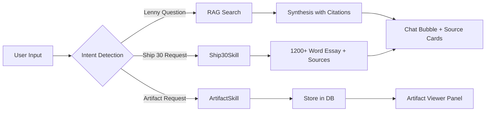

# Design Document: Lenny Growth Assistant

## 1. Target User & Design Goals
The Lenny Growth Assistant is designed for startup founders, growth practitioners, and product leaders who value **evidence, speed, and clean typography**. The interface combines the familiarity of a chat interface with a dedicated, sandboxed **Artifact Viewer** inspired by Claude Artifacts.

---

## 2. Primary Workflows

1. **Grounded Question Answering**: User asks a domain question $\rightarrow$ Evidence is retrieved from transcript embeddings $\rightarrow$ LLM synthesizes answer $\rightarrow$ Response renders with episode title and guest tags.
2. **Ship 30 for 30 Content Generation**: User requests an essay $\rightarrow$ `Ship30Skill` structures the article into Atomic essay format with verified quotes $\rightarrow$ Output includes exact calculated word count.
3. **Artifact Generation & Inspection**: User requests an HTML visualization or Markdown document $\rightarrow$ Assistant generates self-contained artifact $\rightarrow$ Artifact opens automatically in the split-screen Artifact Viewer.

---

## 3. UX Decisions & Aesthetic Philosophy

- **Curated Dark Theme**: Built with rich HSL midnight blues (`#0f172a`, `#1e293b`, `#0b1120`) and vibrant accents (`#3b82f6` blue, `#a78bfa` purple, `#fbbf24` amber) to prevent eye strain and convey an executive, modern feel.
- **Glassmorphic Status Badges**: Top header displays live connection indicators (API status, database latency, active model provider, and Ollama status) without cluttering the screen.
- **Micro-Animations & Smooth Transitions**: Subtle hover transitions on sidebar sessions, tabs, and interactive buttons create a responsive, fluid environment.

---

## 4. Key Interface Components

### A. Sidebar & Session Navigation
- Session list displays active conversation titles, created in descending chronological order.
- One-click deletion with confirmation and cascade removal of associated messages and artifacts.
- "+ New Chat" button instantly resets context and isolates state.

### B. Chat Area & Source Citation UX
- User messages are right-aligned in primary blue bubbles.
- Assistant responses are left-aligned in card-style dark slate bubbles with structured markdown typography.
- **Grounded Citations**: When Lenny episodes are referenced, a collapsible/distinct footer displays:
  - Episode Title
  - Guest Name
  - YouTube Link (when available)
  - Similarity relevance score

### C. In-App Artifact Card
- When an assistant message generates an artifact, an **Artifact Card** is embedded in the chat bubble:
  - Icon & Type Tag (`HTML` or `MARKDOWN`)
  - Artifact Title
  - "Open in Viewer →" button (or "Viewing Now" badge when currently active)

### D. Dedicated Artifact Viewer
- Positioned directly beside the chat area in a 50/50 split screen.
- **Header**:
  - Type badge and artifact title
  - Security indicator tag (`🛡️ Sanitized DOM` or `🔒 Sandboxed`)
  - View mode toggle: **Preview** (rendered HTML/Markdown) vs **Code** (monospace raw syntax)
  - **Copy Content** button with transient "✓ Copied" visual feedback
  - **Close** (✕) button to collapse the viewer back into full-width chat mode
- **Artifact Tab Switcher**: When multiple artifacts are generated within a session, a horizontal scroll tab bar enables rapid toggling between artifacts.

---

## 5. Responsive Behavior
- **Large Screens ($\ge 1200\text{px}$)**: Full three-pane view (Sidebar + Chat Area + Artifact Viewer).
- **Medium Screens ($768\text{px} - 1199\text{px}$)**: Sidebar collapses or shrinks; Chat and Viewer share screen space smoothly.
- **Small Screens ($< 768\text{px}$)**: Artifact Viewer operates as an overlay modal or tabbed view to maximize reading area.

---

## 6. Failure States & Graceful Degradation
- **Ollama Offline**: Assistant displays a user-safe message ("AI service temporarily unavailable") while server logs detailed diagnostic info.
- **Empty Retrieval Results**: If user asks an off-topic question without relevant podcast matches, assistant responds politely using general guidance without fabricating citations.
- **Database Disconnection**: Top health badge turns red ("DB: unhealthy"), preventing broken optimistic state updates.
